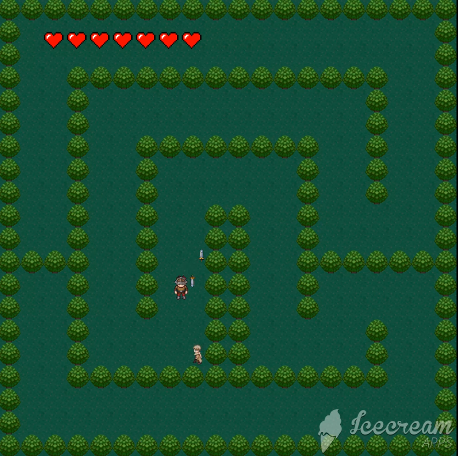

# macbeth-dungeon

**NOTE: Whole repo must be downloaded for game do run properly**

## Arcade 2d dungeon crawler built on Shakespeare's 'Macbeth'.

### Gameplay Instructions
- Spacebar is used throughout game as the action key. Use it to skip dialogues and fire swords

### Game features
- Includes dungeon exploration, boss fights with characters from the play, companions (Ophelia follows you around), and pokemon-style dialog.
- Enemy uses shortest path A-Star algorithm

Written in Java, saved as IntelliJ project

